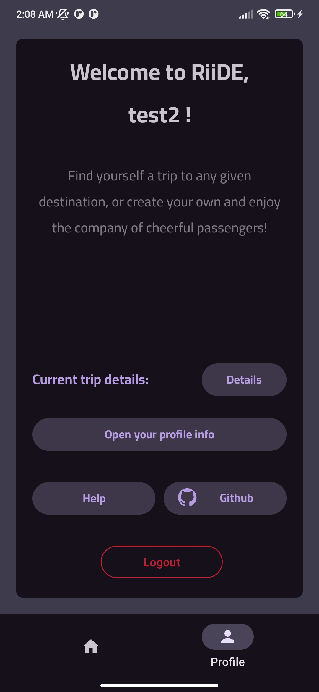
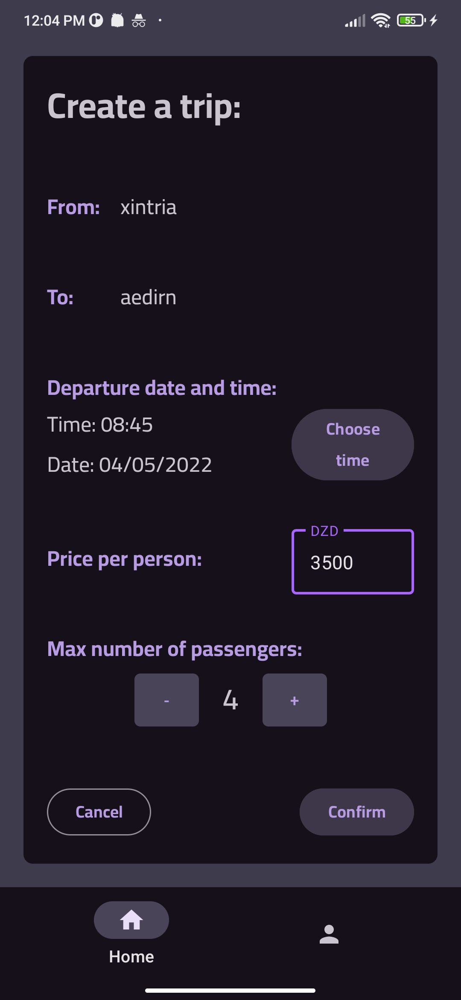

# RiiDE
RiiDE is a carpooling app that lets users search through, join or create trips to any given destination, and also helps managing the pricing, passengers, contact info and timings.

This app was roughly developed in a month from week-end to week-end as an end of cycle CS Bachelor's degree project, so it will not get any further updates after it's done.

**Note:** App is still under developement for the moment.

# Screenshots
|Home Tab|Profile Tab|Creating Trips|
|---|---|---|
||||

# Features
### Finished:
- Auth
- Trip management
- Passanger management
- User profiles
- Search capabilities & indexing
- Rating system
### TODO:
- UI & Design overhaul (Logo, Icon, better color palette..etc)
- French translation (if i actually find the time for it)

# Build
Simply cloning and building with android studio should do the trick, make sure to use the latest androidx libraries.

# Hosting
This app is hosted on a Firebase instance, uses its auth system (that i slightly modified to include usernames), and the Firestore Database.

To host it with another Firebase instance, delete `./app/google-services.json` and replace it with your own generated one, no other configurations needed other than the database rules, as the code will automatically initialize the database and no cloud functions are used.

# DISCLAIMER
This project being my first android project, and because of the very limiting deadline and my lack of experience wth android, the code has a few major issues:
- Since i don't count on updating this on the future, i did not follow code architecture standards such as MVVM.
- Due to zero funding, some code that is supposed to be handled by the server is running client-side, which is bad, but for this scale, it works.
- This is NOT a service, just a small project, and due to the above reasons i do not advice using the code as an example and cannot guarantee anything.
